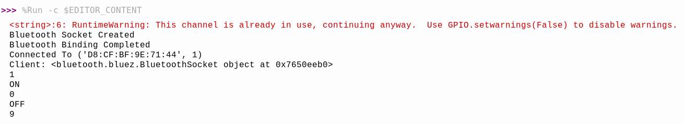
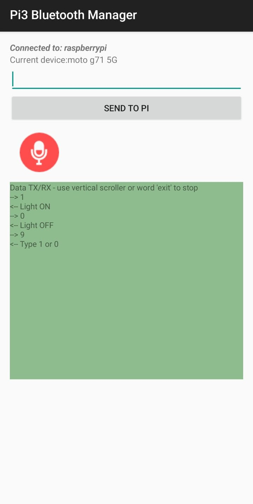

# P5
Controlling an LED via Bluetooth using the Raspberry Pi

  

  <em>P5 Circuit Diagram</em>

___

  

  <em>Activity on the Raspberry Pi after Bluetooth Connection</em>

___

  

  <em>Activity on the Phone after Bluetooth Connection</em>

___
## Steps to Setup Bluetooth
1. Download the [Pi3 Bluetooth Manager](https://github.com/spacebiz24/IoT-Basics/blob/main/Assets/Pi3%20Bluetooth%20Manager.apk).
1. Open the terminal and type `bluetoothctl`.
1. Optionally, change the name of the Pi by typing `system-alias 'New Name'`.
1. Turn on Bluetooth on both the Phone and the Pi.
1. Connect with the phone via Bluetooth.
1. In the terminal, as the phone connects with the Pi, note down the MAC address of the Pi.
1. Run the Python file and interact with the Pi using Bluetooth.
1. Open the app on the phone and connect with the device that matches the MAC address.
