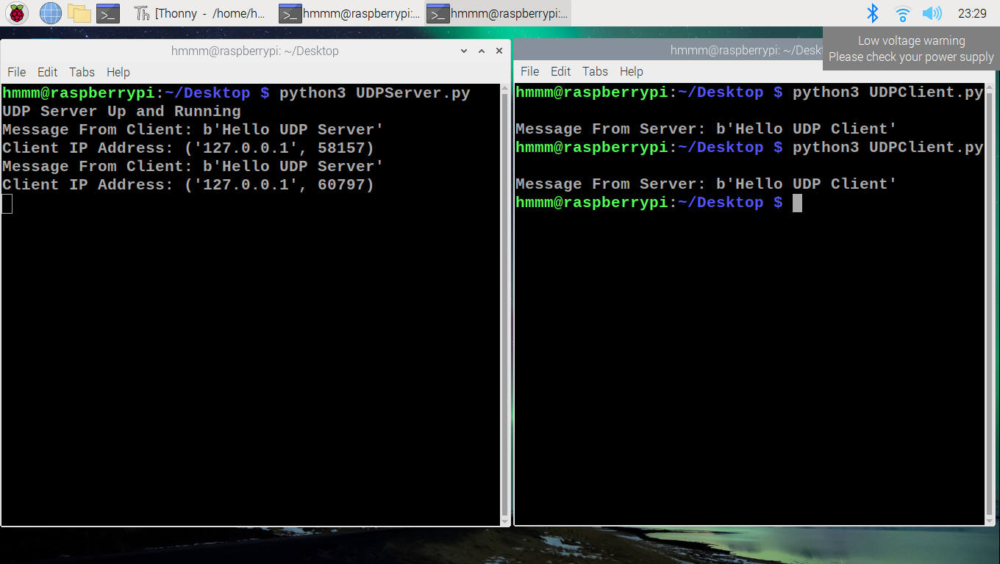

# P6
Send and receive messages to and from a UDP server and client using the Raspberry Pi.

  

  <em>UDP Server and Client Running Side by Side</em>

___
# Steps to run the UDP Client and Server
1. Write the Python programs and save them as Client and Server.
1. Open two terminal windows and use the command `python3 filename.py` and run both the programs simultaneously.
