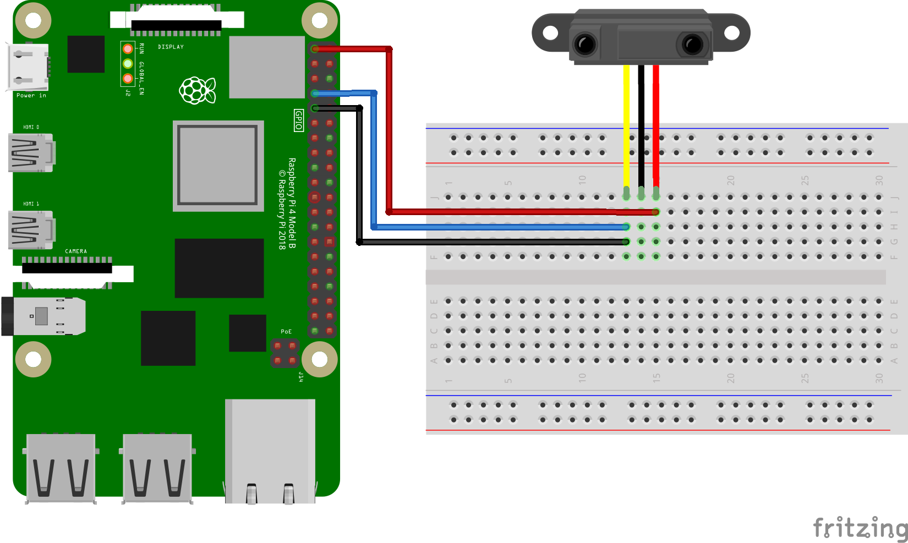
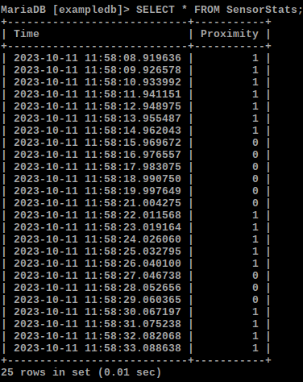

# P7

Perform basic SQL operations with RPi
___

<p align = "center">
  
</p>
<p align = "center">
  <em>P7 Circuit Diagram</em>
</p>

___

<p align = "center">
  
</p>
<p align = "center">
  <em>SQL Database View in the Console</em>
</p>

## Steps to set up MariaDB SQL on the Raspberry Pi
1. Run the following commands.
   ```bash
   sudo apt update && sudo apt upgrade
   sudo apt install mariadb-server-10.0 mariadb-client-10.0
   sudo apt-get install python-mysqldb
   ```
1. To start the setup process of MariaDB, run the following command `sudo mysql_secure_installation`.
1. Set the password and say `Y` to all prompts.
1. Login to SQL using the command `sudo mysql -u root -p`.
1. Run the following SQL commands in succession to create a database, and a table and to configure the table.
   ```SQL
   CREATE DATABASE exampledb;
   CREATE USER 'exampleuser'@'localhost' IDENTIFIED BY 'pimylifeup';
   USE exampledb
   CREATE TABLE SensorStats(Time VARCHAR(50), Proximity FLOAT);
   GRANT ALL PRIVILEGES ON exampledb.* TO 'exampleuser'@'localhost';
   FLUSH PRIVILEGES;
   ```
1. In another terminal, run the Python program in the terminal by typing `python3 P7.py`.
1. After some time, stop the Python program and in the terminal running `mariadb`, run the following command,
   ```SQL
   SELECT * FROM SensorStats;
   ```
